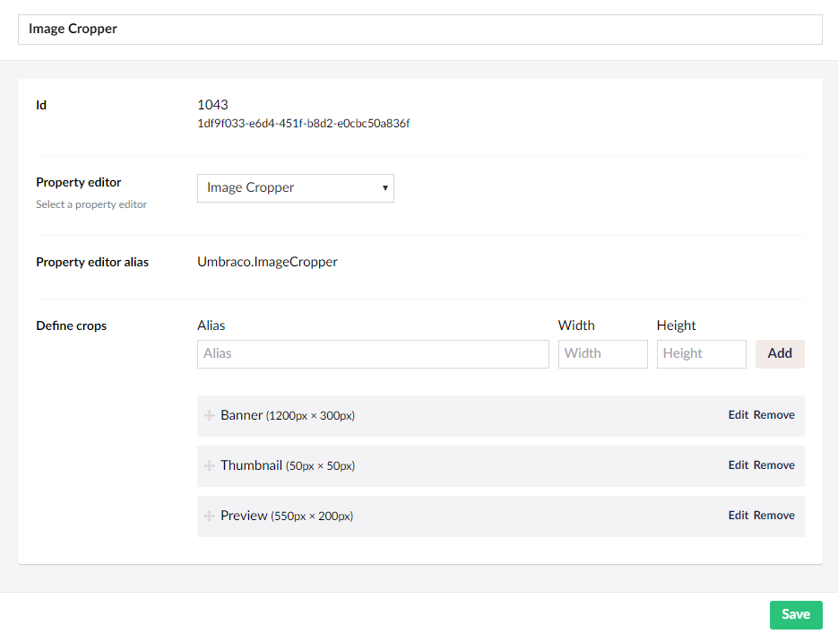
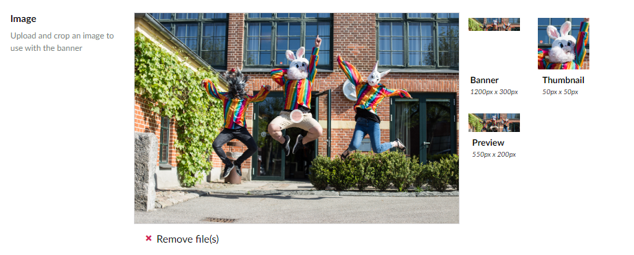
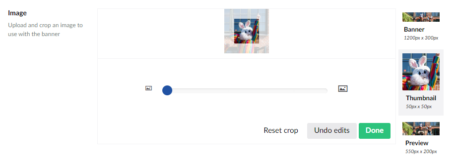

# Image Cropper

`Alias: Umbraco.ImageCropper`

`Returns: JSON`

Returns a path to an image, along with information about focal point and available crops.

## Data Type Definition Example



## Settings 

You can add, edit & delete crop presets the cropper UI can use.

By default, when an image is uploaded using the [Media Picker](../Media-Picker) the default Image Cropper Data Type is used. This means that you can pre-define crops that can be used on all images uploaded to the Umbraco backoffice.

## Content Example 

The Image Cropper provides a UI to upload an image, set a focal point on the image, and optionally crop and scale the image to predefined crops.

By default images in the cropper will be shown based on a set focal point, and only use specific crops if they are available.

The cropper comes in 3 modes:

- Uploading an image
- Setting a focal point
- Cropping the image to predefined crops

### Uploading images
The editor exposes a drop area for files. Click it to upload an image.


### Set focal point

By default, the cropper allows the editor to set a focal point on the uploaded image.

All the preset crops are shown to give the editor a preview of what the image will look like to the end user, when a specific crop is chosen.



### Crop and resize

If needed, the editor can crop the image to specific crop presets, to ensure the right part and size of the image
is shown for a specific crop.



## Sample code

The Image Cropper comes with an API to generate crop URLs. You can also access its raw data directly as a
dynamic object.

### Example to output a "banner" crop from an Image Cropper property with the alias "image"

#### Using the current context

```html

```

#### Using the UrlHelper Extension method

```html

```

### Example to output custom crops - in this case forcing a 300 x 400 px image

#### Using the current context

@if (Model.HasValue("test"))
{
    
}

#### Using the UrlHelper Extension method

```html
@if (Model.HasValue("test"))
{
    
}
```

